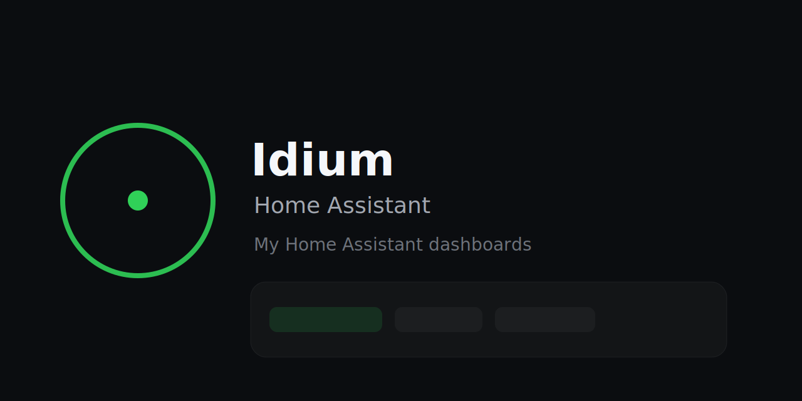

<p align="center">
  
</p>

<p align="center">
  <a href="LICENSE"></a>
  <a href="VERSION"></a>
  <a href="https://www.home-assistant.io/"></a>
</p>

This is my [Home Assistant](https://www.home-assistant.io/) dashboard setup — themes, a Python generator that spits out Lovelace JSON, and the YAML helpers I use at home.

I built it because the default dashboards never quite felt right on a phone or a wall tablet. If something here is useful for your place, help yourself. It will need tailoring to your entities and rooms.

---

## What's in here

- **Themes** — `idium_dark` and `idium_light` in `themes/`
- **Generator** — `generator/idium_gen.py` writes storage-mode dashboard files for Home, rooms, Security, Climate, Office, etc.
- **Helpers** — optional package example for light groups, door summary, office scenes (`packages/`)
- **Docs** — how I install and deploy it (`docs/`)

The dashboards use [Mushroom](https://github.com/piitaya/lovelace-mushroom), [mini-graph-card](https://github.com/kalkih/mini-graph-card), and [card-mod](https://github.com/thomasloven/lovelace-card-mod) via HACS. No custom frontend code.

---

## If you want to try it

### Themes only

Easiest path: install the themes and keep your own dashboards.

1. HACS → **Frontend** → add custom repo `https://github.com/simonhatfield84/idium-home-assistant` (category: **Theme**)
2. Install, reload themes, pick **idium_dark** in your profile

Or copy `themes/*.yaml` into your HA `config/themes/`.

### Full dashboards

You'll need the HACS cards above, plus **Recorder** enabled (for the climate graphs).

```bash
git clone https://github.com/simonhatfield84/idium-home-assistant.git
cd idium-home-assistant
cp config/idium.example.json config/idium.json   # edit entity IDs
./scripts/generate.sh                            # → dist/ha_write_manifest.json
```

Deploy the generated `.storage` files — see [docs/deploying-dashboards.md](docs/deploying-dashboards.md). **Restart Home Assistant once** after that.

Optional helpers:

```bash
cp packages/idium_helpers.yaml.example packages/idium_helpers.yaml
# tweak entity IDs, then include packages in configuration.yaml
```

More detail: [docs/installation.md](docs/installation.md) · [docs/configuration.md](docs/configuration.md)

---

## Layout

| Path | What |
|------|------|
| `themes/` | Dark and light themes |
| `generator/` | Dashboard generator |
| `config/` | Example + local `idium.json` |
| `packages/` | Optional HA helpers (example) |
| `scripts/` | `generate.sh`, `deploy.sh` |
| `docs/` | Installation, config, design notes |

---

## Dashboards the generator builds

| View | Path | Notes |
|------|------|-------|
| Home | `/lovelace/default_view` | Overview, security, climate |
| Security | `/dashboard-home/home` | Alarm, doors, motion |
| Office | `/dashboard-office/office` | Landscape: scenes, lights, Spotify |
| Rooms | `/dashboard-*` | Bedroom, Living, Dining, Kitchen, Hall, Dressing, Climate |

Entity IDs in the generator match *my* house. Change `config/idium.json` for the main cards; edit `generator/idium_gen.py` for rooms and scenes.

Design tokens and colours: [docs/design-system.md](docs/design-system.md)

---

## Contributing

Pull requests and issues are fine — see [CONTRIBUTING.md](CONTRIBUTING.md). I'm not planning big visual changes for v1.0; mostly fixes and docs.

---

## License

[MIT](LICENSE) — Simon Hatfield · simonhatfield@me.com

Not affiliated with Home Assistant Core.
