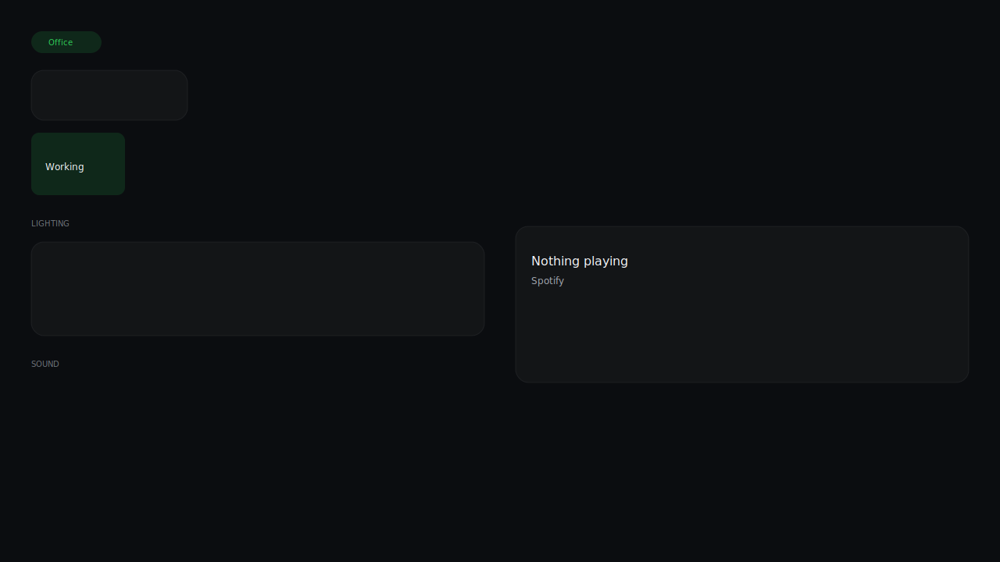
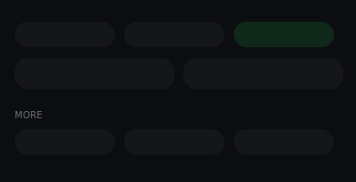

<p align="center">
  
</p>

<p align="center">
  <a href="LICENSE"></a>
  <a href="VERSION"></a>
  <a href="https://www.home-assistant.io/"></a>
  <a href="https://hacs.xyz/"></a>
</p>

**Idium** is a design system and dashboard generator for [Home Assistant](https://www.home-assistant.io/). It turns Lovelace into a calm, premium smart-home interface — closer to Apple Home or a dedicated control panel than a default HA dashboard.

Luxury comes from restraint: typography leads, colour communicates state, and the UI stays out of the way.

---

## Features

- **Design system** — dark (and light) themes, semantic colour tokens, typography scale, spacing grid
- **Dashboard generator** — Python generator produces storage-mode Lovelace JSON for Home, rooms, Security, Climate, and Office layouts
- **Mobile-first navigation** — compact two-row room pills plus secondary “More” section
- **Mushroom + card-mod stack** — built on community cards, not custom frontend code
- **Optional helpers package** — light groups, door summary sensor, office scene tracking (example YAML included)
- **HACS-ready themes** — install themes via HACS; run the generator for full dashboards

## Screenshots

| Home | Office (desktop) | Mobile nav |
|------|------------------|------------|
|  |  |  |

Replace placeholder SVGs with real screenshots before your first release — see [docs/screenshots/README.md](docs/screenshots/README.md).

## Quick start

### 1. Prerequisites

Install via [HACS](https://hacs.xyz/):

- [Mushroom Cards](https://github.com/piitaya/lovelace-mushroom)
- [mini-graph-card](https://github.com/kalkih/mini-graph-card)
- [card-mod](https://github.com/thomasloven/lovelace-card-mod)

Enable the **Recorder** integration (required for climate sparklines).

### 2. Install Idium themes (HACS)

1. HACS → **Frontend** → **Explore & download repositories**
2. Add custom repository: `https://github.com/YOUR_ORG/idium` (category: **Theme**)
3. Install **Idium**
4. Profile → **Theme** → select **idium_dark** (or **idium_light**)

Or manually copy `themes/` into your HA `config/themes/` and reload themes.

### 3. Configure

```bash
cp config/idium.example.json config/idium.json
# Edit entity IDs and owner_name for your home
```

See [docs/configuration.md](docs/configuration.md) for all options.

### 4. Generate dashboards

```bash
./scripts/generate.sh
# Output: dist/ha_write_manifest.json
```

### 5. Deploy (one restart)

Copy manifest entries into `config/.storage/` (or use `./scripts/deploy.sh /path/to/config`).

**Restart Home Assistant once** after deploying `.storage` files.

Full guide: [docs/installation.md](docs/installation.md) · [docs/deploying-dashboards.md](docs/deploying-dashboards.md)

### 6. Optional helpers

```bash
cp packages/idium_helpers.yaml.example packages/idium_helpers.yaml
# Customize entity IDs, add to configuration.yaml:
# homeassistant:
#   packages: !include_dir_named packages
```

Restart once after adding packages.

---

## Repository layout

```
idium/
├── assets/              # Logo, banner, branding
├── config/              # User config (example + local idium.json)
├── docs/                # Documentation
├── generator/           # Dashboard generator (idium_gen.py)
├── packages/            # Optional HA helpers (example)
├── scripts/             # generate.sh, deploy.sh
├── themes/              # idium_dark, idium_light
├── dist/                # Generated manifest (gitignored)
├── hacs.json
├── CHANGELOG.md
├── ROADMAP.md
└── CONTRIBUTING.md
```

---

## Dashboards included

| Dashboard | URL path | Description |
|-----------|----------|-------------|
| Home | `/lovelace/default_view` | Overview, security, climate, quick actions |
| Security | `/dashboard-home/home` | Alarm, doors, motion |
| Office | `/dashboard-office/office` | Landscape panel: scenes, lighting, sound |
| Bedroom, Living, Dining, Kitchen, Hall, Dressing, Climate | `/dashboard-*` | Room-first mobile layouts |

Customize room list and entities in `generator/idium_gen.py` or via `config/idium.json`.

---

## Design philosophy

See [docs/design-system.md](docs/design-system.md) for tokens, typography, and component patterns.

> The interface should feel like an operating system for the home — not a configuration panel.

---

## Contributing

Contributions welcome. Please read [CONTRIBUTING.md](CONTRIBUTING.md) and [CODE_OF_CONDUCT.md](CODE_OF_CONDUCT.md).

**UI design is frozen at v1.0.0.** Bug fixes and documentation improvements are encouraged; visual redesigns should be discussed in an issue first.

---

## Security

Report vulnerabilities privately — see [SECURITY.md](SECURITY.md).

---

## License

[MIT License](LICENSE) © Idium Contributors

---

<p align="center">
  
  <br />
  <sub>Built for Home Assistant · Not affiliated with Home Assistant Core</sub>
</p>
